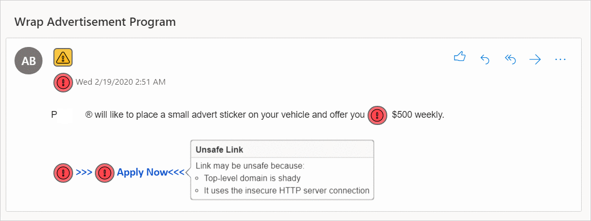
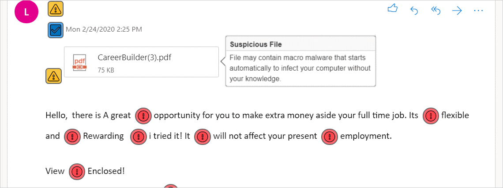

# Hamspam

Hamspam is a browser extension that injects visual feedback about suspicious emails into your page.

## Preview

Hamspam scans for malware [checkpoints](#checkpoints "checkpoints") and marks all vulnerabilities with color-coded icons:

| Icon | Severity |
|-|-|
 | Low |
 | Medium |
 | High |

<p align="center"></p>

## Getting Started

### Prerequisites

* Node.js
```
$ yum install nodejs
$ yum install npm
```

* Install npm packages
```
npm install
```

### Development
* Watch for updates to code and compile automatically: `npm run develop`
* Build the optimized production: `npm run build`
* Run all unit tests: `npm run test`

### Usage

1. Create a class that extends AbstractEmail and another class that extends AbstractView.

2. Define those new classes in [Lib.ts](src/Lib.ts "Lib.ts")
```
export * from './<Email>';
export * from './<EmailView>';
```

3. Add a configuration in [config.yaml](dist/config.yaml "config.yaml")
```
email:
  - {name: <Email>, hostname: <email.com>, view: <EmailView>}
```

#### AbstractEmail

##### Checkpoints

| Checkpoint | Method | Return | Description |
|-|-|-|-|
| Sender | `isTrustedSender(<String> sender)` | `bool` | Checks if sender's address is in whitelist |
| Received timestamp | `deliveredLateNight(<String> deliveryTime)` | `bool` | Checks if email was received overnight |
| Links | `isMaliciousLink(<String> uri)` | `array` | Checks if a link is: <ul>   <li>an http url</li>   <li>an IP address</li>   <li>a non-standard port (https over 80 and http over 443)</li>   <li>authentication credentials</li>   <li>a shady top-level domain</li>   <li>a file path on local computer</li>   <li>redirecting to another page</li>   <li>containing - or %</li>   <li>hosted on a free web hosting provider</li> </ul> |
| Attachments | `isSuspiciousFile(<String> filename)` | `bool` | Checks if an attachment is:<ul>   <li>an executable file that may contain malicious code</li>   <li>script or command file</li>   <li>a pdf and MS Office that may contain macro malware</li> </ul> |
| Spam words | `findSpamWords(<HTMLElement> test)` | `array` | Searches for every spam word and its start and end position. Built-in text recognition:<ul>   <li>converts emoji to text description to detect spam words</li>   <li>detects spam words in an image</li> </ul> |

##### Parsing

| Method | Return | Description |
|-|-|-|
| `getBody()` | `object` | Container of email body |
| `getSender()` | `object` | Container of sender's email address |
| `getSenderString()` | `str` | Sender's email address |
| `getDeliveryTime()` | `object` | Container of received timestamp |
| `getDeliveryTimeString()` | `str` | Received timestamp |
| `getLink()` | `array` | All links |
| `getLinkString()` | `array` | All link texts |
| `getAttachment()` | `array` | All containers of attachments |
| `getAttachmentString()` | `array` | All filenames |

#### AbstractView

To use your own icons, override `getIndicator()` and `getIndicatorClass()`.

| Method | Return | Icon Positon |
|-|-|-|
| `showIfIsTrustedSender(<HTMLElement> position, <Boolean>isTrustedSender)` | - | Sender's email address |
| `showIfDeliveredLateNight(<HTMLElement> position, <Boolean>deliveredLateNight)` | - | Received timestamp |
| `showMaliciousLink(<HTMLElement> position, <MaliciousLinkType[]> maliciousLinkType` | - | Each link |
| `showSuspiciousFile(<HTMLElement> position, <Boolean> isSuspiciousFile)` | - | Each attachment |
| `showSpamWord(<String> triggerWord)` | `str` | Each spam word  |

#### Configuration

##### email
- `name`: child class of AbstractEmail
- `hostname`: the last part of the email address that comes after the at sign
- `view`: child class of AbstarctView

##### sender-whitelist
Whitelist of email addresses.

Using regular expressions: `\*@\*.email.com` will whitelist all email addresses ending with @email.com and @sub.email.com

##### late-delivery
- `from`: starting time of overnight hours (default: 300=5am)
- `to`: ending time of overnight hours (default: 1320=10pm)

Increase by 60 every hour after midnight. 0=midnight, 1=0:01am, 30=0:30am, 60=1am, 720=noon, 780=1pm

##### suspicious-file-extensions

Blocked attachment file extensions.

##### spam-words

Blocked words and phrases.

Using regular expressions:
- `gift( card)?` = gift, gift card

A blocked term is insensitive to blank spaces:
- `sign up` = signup (0 space), sign up (1), sign&nbsp;&nbsp;up (2)
